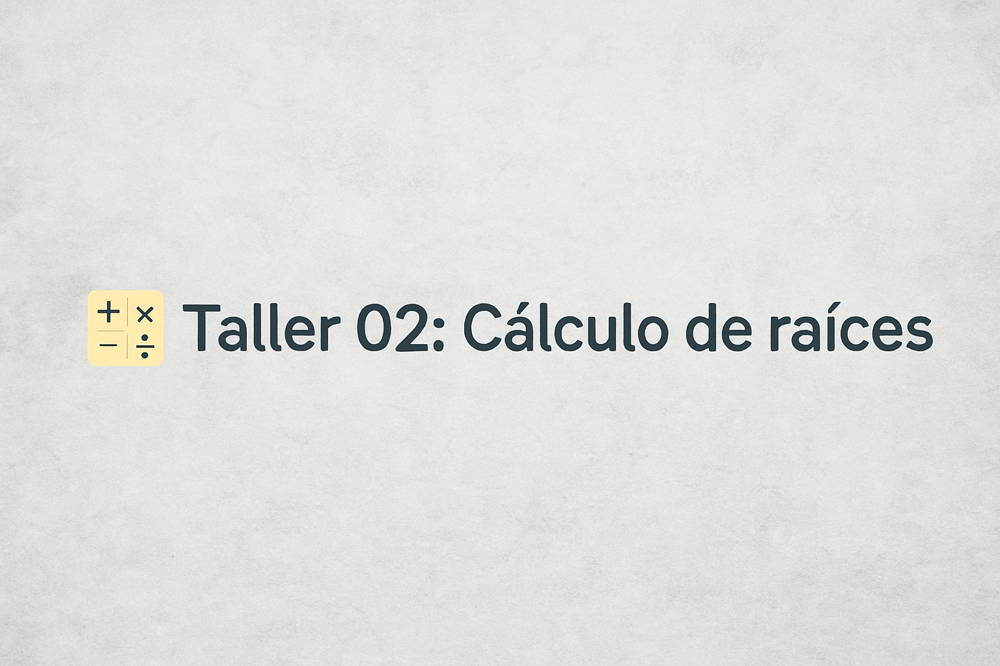

# 🧮 Taller 02: Cálculo de raíces

Este repositorio contiene la solución al Taller 02 del curso de Métodos Numéricos, centrado en el cálculo de raíces de funciones. Las actividades incluyen la resolución de un polinomio de cuarto grado, el análisis de intersecciones de una curva implícita con un eje, y el estudio del comportamiento de una función racional trascendental.

